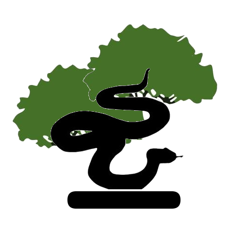

# Python Forest from Scratch

This project consist on implementing common tree and forest algorithms in plain Python from scratch. This has two goals:

* Emulate the Sklearn Tree and Forests using pure Python (instead of Cython).

* Add new algorithms and metrics to research and test new implementations.


#### Dependencies

- Python>=3.6
- Numpy==1.18.1
- SciPy==1.4.1


<p align="center">
    
</p>

## The Zen of Python Trees

This project follows the pythonic filosofy of looking foward easyness and readability when coding. All the code in this project try to focus only on the soul of the tree and forest algorithms, avoiding all the stuff related with computation performance, memory issues and resiliance code.

```
    If the implementation is hard to explain, it's a bad idea.
    If the implementation is easy to explain, it may be a good idea.
```
 
## Bonsai. Lite Tree implementation.

Bonsais are just a naming for some lite implementation of the tree algorithms which its interface and structure try to mimic the [Scikit-Learn tree](https://scikit-learn.org/stable/modules/tree.html) implementation.

```shell

        {'feature': 2,
         'left_node': {'feature': 3,
                       'left_node': {'feature': 3,
                                     'left_node': {'feature': 3,
                                                   'left_node': {'value': 0.0},
                                                   'right_node': {'value': 0.0},
                                                   'threshold': 0.3,
                                                   'value': 0.0},
                                     'right_node': {'value': 0.0},
                                     'threshold': 0.5,
                                     'value': 0.0},
                       'right_node': {'value': 0.0},
                       'threshold': 0.6,
                       'value': 0.0},
          'right_node': {'feature': 3,
                         'left_node': {'feature': 2,
                                       'left_node': {'value': 1.0},
                                       'right_node': {'value': 2.0},
                                       'threshold': 5.6,
                                       'value': 1.0},
                        'right_node': {'value': 2.0},
                        'threshold': 1.8,
                        'value': 2.0},
         'threshold': 3.0,
         'value': 1.0}
\=====================================================================/
 \                                                                  /
  \===============================================================/
```

## Garden. Lite Forest implementation.

Garden are just a factory of DecisionBonsaiClassifiers. The difference with the conventional Forest are just that they only has the main functionalities to train and predict data and they are not configured to make a parallel jobs.

```python
from tree import DecisionBonsaiClassifier

class RandomGardenClassifier():

    """
    Base class for forest of Bonsai-based classifiers.
    """

    base_estimator_ = DecisionBonsaiClassifier()
    
```

#### Contact and Help

Any help, consideration, opinion or suggestion is welcome. Do not doubt to write me!

- Email: <delgadopanadero@gmail.com>
- Linkedin: [in/delgado-panadero/](https://www.linkedin.com/in/delgado-panadero/)

