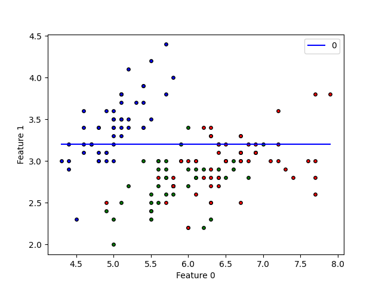
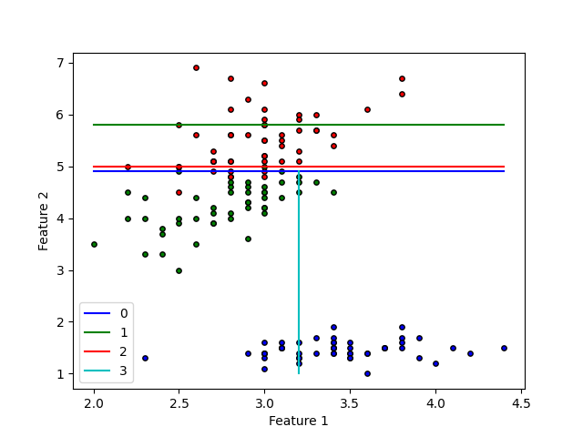
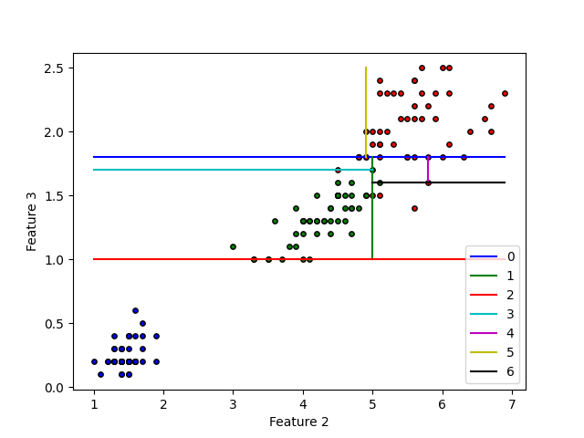

# Python Forest from Scratch


<p align="center">
    
</p>


## The Zen of Python for Trees

This project follows the pythonic filosofy of looking foward easyness and readability when coding. All the code in this project try to focus only on the soul of the tree and forest algorithms, avoiding all the stuff related with computation performance, memory issues and resiliance code.

```
    If the implementation is hard to explain, it's a bad idea.
    If the implementation is easy to explain, it may be a good idea.
```

This project consist on implementing common tree and forest algorithms in plain Python from scratch. This emulate the Sklearn Tree and Forests using pure Python (instead of Cython).


## Bonsai. Lite Tree implementation.

Bonsais are just a naming for some lite implementation of the tree algorithms which its interface and structure try to mimic the [Scikit-Learn tree](https://scikit-learn.org/stable/modules/tree.html) implementation.


#### Usage: Bonsai Classification

```python
from sklearn.datasets import load_iris
from sklearn.metrics import confusion_matrix
from sklearn.model_selection import train_test_split

from skratch.bonsai import DecisionBonsaiClassifier

iris = load_iris()
X = iris.data
y = iris.target
X_train, X_test, y_train, y_test = train_test_split(X,y)

clf = DecisionBonsaiClassifier().fit(X_train, y_train)
y_pred = clf.predict(X_test)

print(confusion_matrix(y_test,y_pred))
```

#### Usage: Bonsai Regression

```python
from sklearn.datasets import load_iris
from sklearn.metrics import confusion_matrix
from sklearn.model_selection import train_test_split

from skratch.bonsai import DecisionBonsaiClassifier

boston = load_boston()
X = boston.data
y = boston.target
X_train, X_test, y_train, y_test = train_test_split(X,y)

reg = DecisionBonsaiRegressor().fit(X_train, y_train)

y_pred = clf.predict(X_test)
print(np.sqrt(np.sum((y_test-y_pred)**2)))
```

#### Bonsai Graph

```python
from sklearn.datasets import load_iris
from sklearn.metrics import confusion_matrix
from pprint import pprint

iris = load_iris()
X = iris.data
y = iris.target

clf = DecisionBonsaiClassifier().fit(X, y)

print("\n"+" "*35+"BONSAI GRAPH\n")
pprint(clf.bonsai_.graph)
print("\\"+"‾"*80+"/\n \\"+" "*78+"/\n  \\"+"_"*76+"/")
```

```shell
                                    BONSAI GRAPH

  {'feature': 3,
   'left_node': {'value': 0},
   'right_node': {'feature': 3,
                  'left_node': {'feature': 2,
                                'left_node': {'feature': 3,
                                              'left_node': {'value': 1},
                                              'right_node': {'value': 2},
                                              'threshold': 1.7,
                                              'value': 1},
                                'right_node': {'feature': 3,
                                               'left_node': {'value': 2},
                                               'right_node': {'feature': 2,
                                                              'left_node': {'value': 1},
                                                              'right_node': {'value': 2},
                                                              'threshold': 5.8,
                                                              'value': 1},
                                               'threshold': 1.6,
                                               'value': 2},
                                'threshold': 5.0,
                                'value': 1},
                  'right_node': {'feature': 2,
                                 'left_node': {'feature': 1,
                                               'left_node': {'value': 2},
                                               'right_node': {'value': 1},
                                               'threshold': 3.2,
                                               'value': 2},
                                 'right_node': {'value': 2},
                                 'threshold': 4.9,
                                 'value': 2},
                  'threshold': 1.8,
                  'value': 1},
   'threshold': 1.0,
   'value': 0}
\‾‾‾‾‾‾‾‾‾‾‾‾‾‾‾‾‾‾‾‾‾‾‾‾‾‾‾‾‾‾‾‾‾‾‾‾‾‾‾‾‾‾‾‾‾‾‾‾‾‾‾‾‾‾‾‾‾‾‾‾‾‾‾‾‾‾‾‾‾‾‾‾‾‾‾‾‾‾‾‾/
 \                                                                              /
  \____________________________________________________________________________/

```

## Garden. Lite Forest implementation.

Garden are just a factory of DecisionBonsaiClassifiers. The difference with the conventional Forest are just that they only has the main functionalities to train and predict data and they are not configured to make a parallel jobs.


#### Usage. Random Gargen Classification

```python
from sklearn.datasets import load_iris
from sklearn.metrics import confusion_matrix
from sklearn.model_selection import train_test_split

from skratch.garden import RandomGardenClassifier

iris = load_iris()
X = iris.data
y = iris.target
X_train, X_test, y_train, y_test = train_test_split(X,y)

estimator_params = {
    "max_features": X.shape[1]-2,
    "max_samples" : X.shape[0]/0.6
}

clf = RandomGardenClassifier(n_estimators=100,
                             estimator_params=dict())
clf.fit(X_train, y_train)

y_pred = clf.predict(X_test)

print(confusion_matrix(y_test,y_pred))
```


#### Usage. Boosting Garden Classification

```python
from sklearn.datasets import load_iris
from sklearn.metrics import confusion_matrix
from sklearn.model_selection import train_test_split

from skratch.garden import BoostingGardenClassifier

iris = load_iris()
X = iris.data
y = iris.target
X_train, X_test, y_train, y_test = train_test_split(X,y)

clf = BoostingGardenClassifier(n_estimators=10).fit(X_train, y_train)
y_pred = clf.predict(X_test)

print(confusion_matrix(y_test,y_pred))
```

## Visualize Splits

```python
from sklearn.datasets import load_iris

from skratch.tools import SplitVisualizer
from skratch.bonsai.decision_bonsai_classifier import DecisionBonsaiClassifier

data = load_iris()
X = data.data
y = data.target

clf = DecisionBonsaiClassifier()
clf.fit(X,y)

SplitVisualizer().plot(clf,X,y)
```
<p align="left">
    
    
    
</p>


#### Contact and Help

Any help, consideration, opinion or suggestion is welcome. Do not doubt to write me!

- Email: <delgadopanadero@gmail.com>
- Linkedin: [in/delgado-panadero/](https://www.linkedin.com/in/delgado-panadero/)

